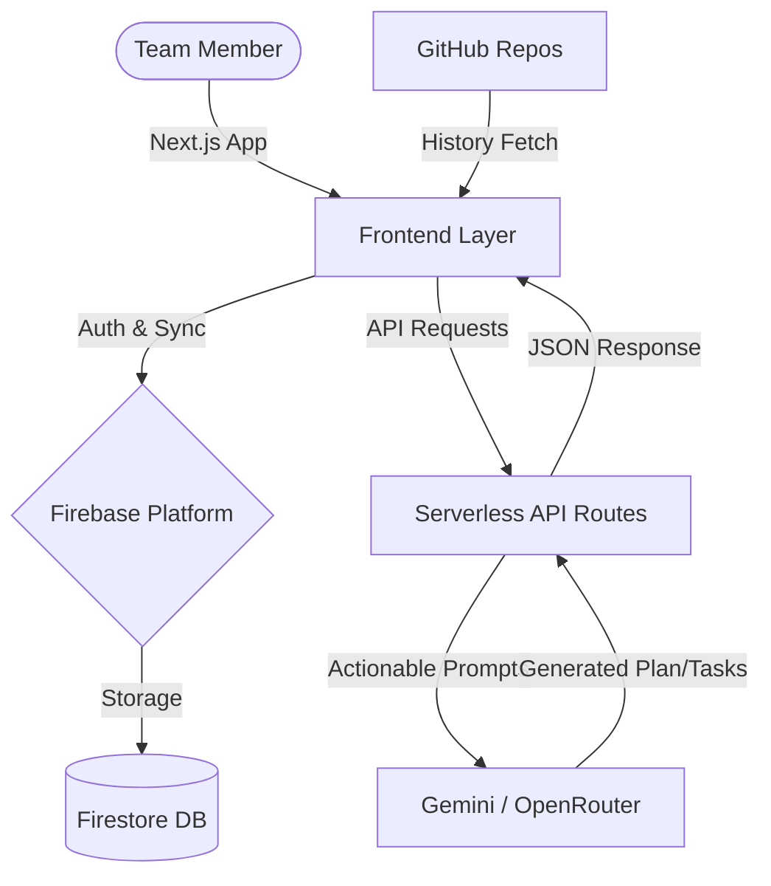

<div align="center">

# 🚀 HackMate AI
### *Empowering Hackathon Teams with AI-Driven Execution*

[](https://nextjs.org/)
[](https://firebase.google.com/)
[](https://deepmind.google/technologies/gemini/)
[](https://tailwindcss.com/)

<br/>

[**🌐 Explore the Live App Here**](https://hackmateai-production.up.railway.app/)

</div>

---

## 🌟 Vision
**HackMate AI** isn't just another task manager. It's a specialized **AI Co-pilot** for the intense, sleep-deprived environment of hackathons. It bridges the gap between a "cool idea" and a "winning project" by automating the heavy lifting of project management, task breakdown, and technical scoping.

---

## 🛠️ Features

| Feature | Description |
| :--- | :--- |
| **🔐 Authentication & Teams** | Secure Google/GitHub login via Firebase. Join team projects instantly using a secure 6-character code. |
| **🧠 AI Idea Lab** | Converts fragmented hackathon ideas into a full technical specification (problem statement, features, risks, and tech stack) using Gemini via OpenRouter. |
| **⚡ Instant Backlog & Kanban** | Auto-generate actionable tasks directly from your idea. Track progress on a drag-and-drop Kanban board (ToDo, InProgress, Done). |
| **🛰️ Real-time Sync** | Multi-user collaboration powered by Firebase Firestore. Every task move, chat message, and status update is instantly visible to all team members. |
| **💬 AI Mentor & Team Chat** | Ask technical questions and get debugging help from an embedded AI Mentor. Coordinate with your human team members in a dedicated real-time chat. |
| **🎨 Collaborative Whiteboard** | Brainstorm architecture and user flows together on a real-time, multi-player whiteboard (powered by `tldraw`). |

---

## 🏗️ System Architecture



- **Frontend Framework**: [Next.js 16 (App Router)](https://nextjs.org/)
- **Database & Sync**: [Cloud Firestore](https://firebase.google.com/docs/firestore) (NoSQL)
- **Authentication**: [Firebase Auth](https://firebase.google.com/docs/auth)
- **AI Integration**: [OpenRouter / Gemini Models](https://openrouter.ai/)
- **Styling & UI**: [Tailwind CSS v4](https://tailwindcss.com/) + ShadCN UI (Radix UI primitives)
- **Diagrams/Whiteboard**: `tldraw`

---

## 🚀 Local Deployment & Setup

### 1. Clone & Install
```bash
git clone https://github.com/KhairnarLokesh/Hackmateai.git
cd Hackmateai
npm install
```

### 2. Environment Configuration
Create a `.env.local` file in the root directory and populate it with your Firebase and OpenRouter credentials:

```env
# Firebase Configuration
NEXT_PUBLIC_FIREBASE_API_KEY="your_api_key"
NEXT_PUBLIC_FIREBASE_AUTH_DOMAIN="your_project.firebaseapp.com"
NEXT_PUBLIC_FIREBASE_PROJECT_ID="your_project_id"
NEXT_PUBLIC_FIREBASE_STORAGE_BUCKET="your_project.firebasestorage.app"
NEXT_PUBLIC_FIREBASE_MESSAGING_SENDER_ID="your_sender_id"
NEXT_PUBLIC_FIREBASE_APP_ID="your_app_id"

# OpenRouter (AI Generation)
OPENROUTER_API_KEY="sk-or-v1-..."
```

### 3. Launch Development Server
```bash
npm run dev
```
The application will be running at [http://localhost:3000](http://localhost:3000).

---

## 🔒 Security & Database Rules
The project utilizes Firestore Security Rules to protect data. Ensure your Firestore rules are set properly to allow authenticated team members to read and write to their specific project subcollections (tasks, messages, whiteboard, etc.).
